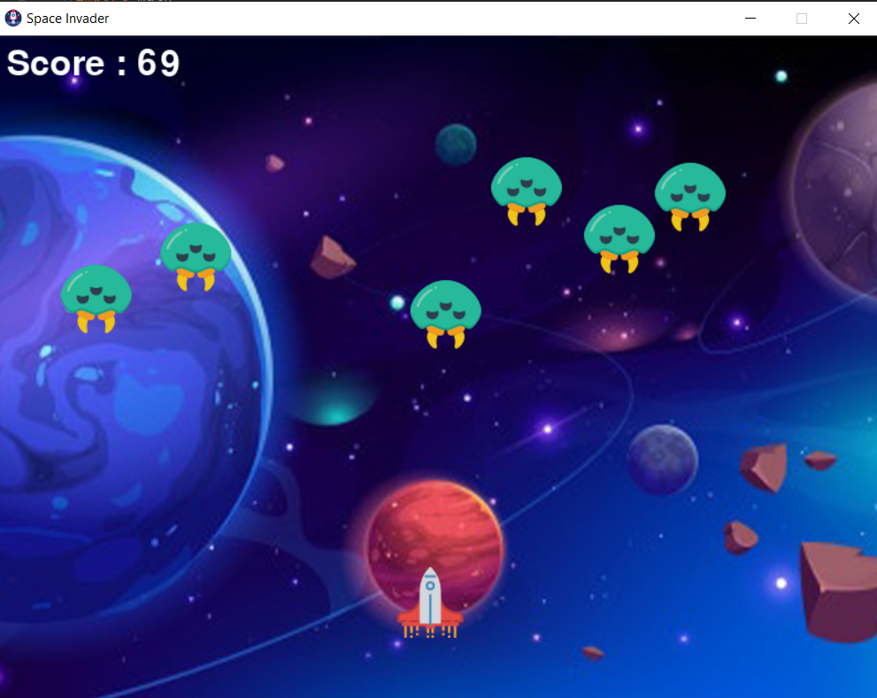

# Space_Invader_Game
## ⭐ Classic 2D Space Invader Game made using Python PyGame module.

## ⚡ About

### 🚀 Language

     
 
 ### 🎮 Game Guide
 (1) Just open the source file in any IDE like VSCode, Pycharm, etc.
 
 (2) Run the file.
 
     ❗ If it gives error then you need to install Python or you need to install pygame.
     
     ✔ Install pygame using command prompt
         (i) Open command prompt as administrator
         (ii) If you already install python then type (pip install pygame) in command prompt
         (iii) If python is not install then first install it and do the step ii.
         
 (3) You can control the space sheep using the arrow keys
 
 (4) This is a never ending game, if you kill a monster another monster gets spawn.
 
 (5) Click on the exit key to terminate the program.
 

 
 ### 📌 Screenshot
 
   
